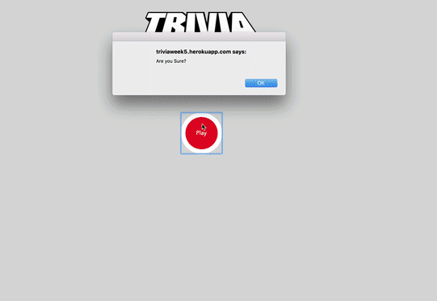

## Trivia Game - A web based Trivia Game.  

A Web based Javascript/ HTML5 Trivia application that uses the Random Question API to grab random questions for a users to pick from a multiple choice list of questions.

## Live Demo

[See Trivia Game Live](https://ramirolpz55.github.io/TriviaGame/)

## Usage

1. Clone repo
2. npm install
3. cd TriviaGame
4. open index.html in any browser
5. Follow game instruction and choose a character. 
6. ENJOY! 

## Contributing

1. Fork it!
2. Create your feature branch: `git checkout -b my-new-feature`
3. Commit your changes: `git commit -am 'Add some feature'`
4. Push to the branch: `git push origin my-new-feature`
5. Submit a pull request :D

## Tech Used 

* HTML5 
* CSS 
* JAVASCRIPT 
* CSS 

## Notes:

* Trivia game that shows only one question until the player answers it or their time runs out.
* If the player selects the correct answer, App will show a screen congratulating them for choosing the right option. 
* After a few seconds, the app will display the next question.
* If the user answer the questions wrong they will see a GIF with a loser theme.
* If the player runs out of time, app tells the player that time's up and then displays the correct answer. 
* Results will show on the final screen, shows the number of correct answers, incorrect answers, and an option to restart the game (without reloading the page).

## License

N/A
